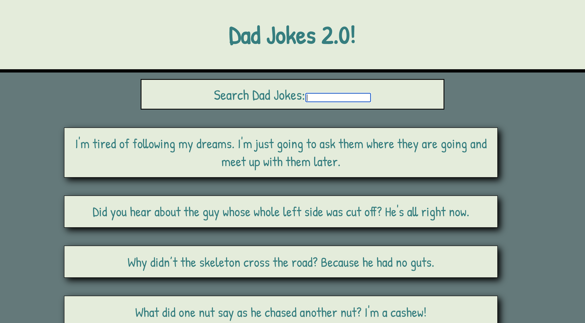

# Dad Jokes 2.0 is here!

This is a new and imporved iteration of the previous Dad Jokes app you already love!

## Technology Used

This is a single page React app using functional component based architecture. Hooks and Props are used for state management. The useEffect hook makes an intial fetch call to the Dad Jokes API. These initial jokes are rendered until the user enters a search term in the form. The form input is used to programatically update the fetch call on change, and new jokes matching the search term are rendered!



## Installation

You will need the proper node packages installed to contribute to this project. Use the CLI to install the proper node packages in the directory where you have cloned the repository. The necessary dev dependencies can always be found in the package.json. The following CLI command will install dev dependencies listed in the package.json

```bash
npm install
```

To start the react app in your browser run
```npm start```

## Usage

Simply enter a word in the search bar to find jokes related to the search term!

## Contributing
Pull requests are welcome. For major changes, please open an issue first to discuss what you would like to change.


Repo: https://github.com/bryan-emerson/jokeDad